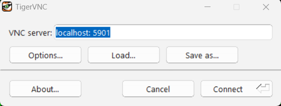
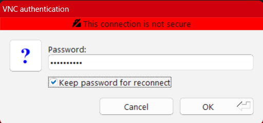
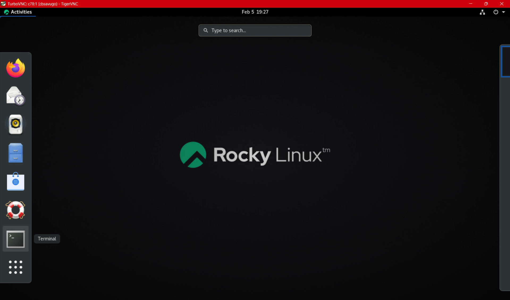

# Soltuions
## Set the spawn point
 For default town

## Set the destination
 for default town

# Added Code Segment to gather list of stop signs on the map and their locations

# Setup
## In CMD Terminal Window #1
Open COmmand pormpt

Connect to Arc
Command:
```
ssh arc
```

Output:
```
===================================================
               Welcome to ARC V3
===================================================
Notice: Do NOT use srun, use salloc instead.
See https://arcb.csc.ncsu.edu/~mueller/cluster/arc/
===================================================
Last login: Thu Feb  5 13:25:08 2026 from 10.155.30.221
```

Join ARC node with Carla installed 
Command:
```
salloc -p csc549
```

Output:
```
salloc: slurm_job_submit: interactive job submitted by user_id:370086 to partition:csc549 limited to 6 hours
salloc: Granted job allocation 192714
salloc: Nodes c78 are ready for job
```

Start VNC Session 
Command:
``` 
export LIBGL_DRIVERS_PATH="/usr/lib64/dri"
export PATH=$PATH:/opt/TurboVNC/bin
export LC_ALL=en_US.UTF-8
vncserver -depth 24 -geometry 1680x1050 :1
vncserver -list
```

Output:
```
[cbsavugo@c78 ~]$ export LIBGL_DRIVERS_PATH="/usr/lib64/dri"
US.UTF-8
vncserv[cbsavugo@c78 ~]$ export PATH=$PATH:/opt/TurboVNC/bin
[cbsavugo@c78 ~]$ export LC_ALL=en_US.UTF-8
[cbsavugo@c78 ~]$ vncserver -depth 24 -geometry 1680x1050 :1

Desktop 'TurboVNC: c78:1 (cbsavugo)' started on display c78:1

Starting applications specified in /opt/TurboVNC/bin/xstartup.turbovnc
Log file is /home/cbsavugo/.vnc/c78:1.log

[cbsavugo@c78 ~]$ vncserver -list

TurboVNC sessions:

X DISPLAY #     PROCESS ID      NOVNC PROCESS ID
:1              1389053
```

## In CMD Terminal Window #2
Connect to Arc
Command:
```bash 
ssh -L 5901:<terminal_1-node>:5901 <arc ssh key> # Example 
ssh -L 5901:c78:5901 arc # Example 
```

Output:
```
===================================================
               Welcome to ARC V3
===================================================
Notice: Do NOT use srun, use salloc instead.
See https://arcb.csc.ncsu.edu/~mueller/cluster/arc/
===================================================
Last login: Thu Feb  5 18:45:51 2026 from 10.137.228.158
[cbsavugo@login2 ~]$ ssh -L 5901:c78:5901 arcv
```


## Using TigerVNC Application
# Connect to VNC
Connect to `localhost: 5901`


Enter Password


# Open Terminal
Open Terminal on Rockey Linux by clicking `Activities` > `Terminal`


# Install Python Despendencies
Command:
```
export UE4_ROOT=~fmuelle/carla-9.14/UnrealEngine_4.26/
export PYTHONPATH=~fmuelle/carla-9.14/PythonAPI/carla/dist/carla-0.9.14-py3.7-linux-x86_64.egg
export LD_LIBRARY_PATH=pwd:$LD_LIBRARY_PATH
```
Output: 
```
[cbsavugo@c78 ~]$ export UE4_ROOT=~fmuelle/carla-9.14/UnrealEngine_4.26/
[cbsavugo@c78 ~]$ export PYTHONPATH=~fmuelle/carla-9.14/PythonAPI/carla/dist/carla-0.9.14-py3.7-linux-x86_64.egg
[cbsavugo@c78 ~]$ export LD_LIBRARY_PATH=pwd:$LD_LIBRARY_PATH
```

# Start Carla Simulator
```
sh ~fmuelle/carla-9.14/CarlaUE4.sh -fps=10 -benchmark-quality-level=Low &
```