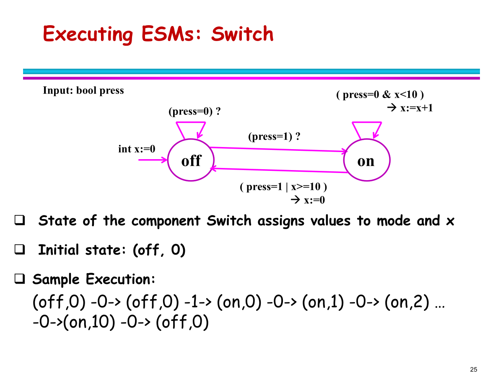
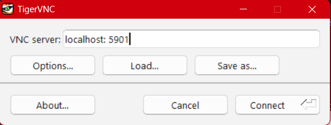
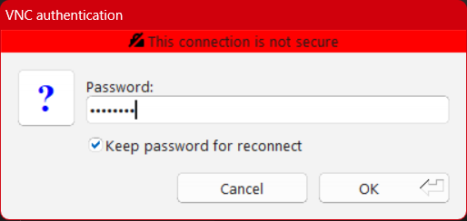
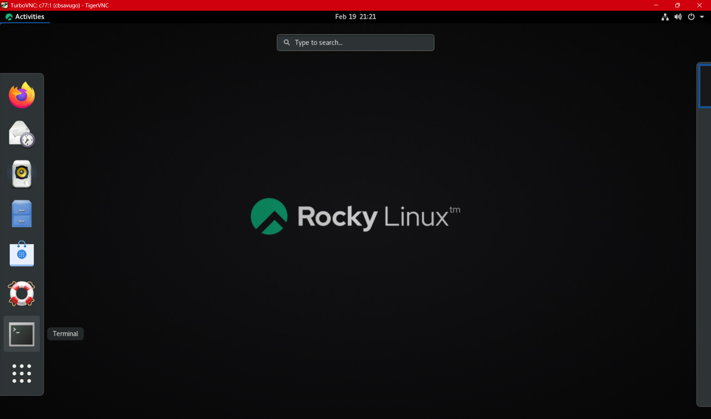
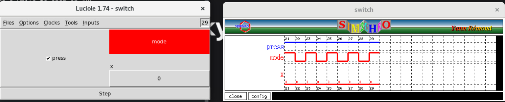

# HW2 – Lustre Switch Automaton (ARC)

This README contains **two major parts**:

1) Full Lustre V6 setup guide (first-time setup on ARC)  
2) Solution to the Switch Automaton assignment

---

# PART I — FIRST-TIME LUSTRE SETUP ON ARC

This entire section preserves the original setup documentation and should remain in the submission for reproducibility.

---

## 1. Start an interactive ARC job first

```bash
powershell -NoProfile -ExecutionPolicy Bypass -File "C:\Users\consa\Downloads\Academics\NC_STATE\2025-2026\SPRING_2026\RTOS ML\RTOS-ARC\tools\set-arc-node.ps1"
```

---

## 2. Setup Local Workspace

```bash
mkdir -p /home/cbsavugo/RTOS-ARC/hw2/p1 /home/cbsavugo/RTOS-ARC/hw2/p2 /home/cbsavugo/RTOS-ARC/hw2/p3 /home/cbsavugo/RTOS-ARC/tools/lustre

cd /home/cbsavugo/RTOS-ARC/tools/lustre/
```

---

## 3. Install Lustre V6 Tools

```bash
cp /mnt/beegfs/fmuelle/tex/ncsu/classes/autodrive/hw/hw2/x86_64-Linux-lv6-bin-dist.tgz .

tar xvfz `arch`-`uname`-lv6-bin-dist.tgz
```

Download helper binary:

```bash
wget https://homepage.cs.uiowa.edu/~tinelli/classes/181/Spring10/Tools/Luke/Linux/luke.gz

gunzip luke.gz

chmod 755 luke
```

Create required symlink:

```bash
ln -s /usr/lib/libgmp.so.10 libgmp.so.3
```

---

## 4. Configure Environment (Each Session)

```bash
export LV6_PATH="/home/<unityid>/<path>/lv6-bin-dist/"
. "/home/<unityid>/<path>/v6-tools.sh"
export LD_LIBRARY_PATH="$LD_LIBRARY_PATH:/home/<unityid>/<path>"
export PATH=$PATH:/home/cbsavugo/RTOS-ARC/tools/lustre
```

### Optional — Add to `.bashrc`

```bash
echo '
# ===== RTOS ML / LV6 Toolchain Setup =====
export LV6_PATH="/home/cbsavugo/RTOS-ARC/tools/lustre/lv6-bin-dist/"
. /home/cbsavugo/RTOS-ARC/tools/lustre/v6-tools.sh
export LD_LIBRARY_PATH="$LD_LIBRARY_PATH:/home/cbsavugo/RTOS-ARC/tools/lustre"
export PATH="$PATH:/home/cbsavugo/RTOS-ARC/tools/lustre"
' >> /home/cbsavugo/.bashrc
```

---

## 5. Sanity Checks

```bash
lv6 -help
luciole -help
```

---

## 6. Manual Lustre Workflow

Compile:

```bash
lv6 -cc switch.lus -n switch
./switch.exec
```

Run GUI:

```bash
luciole switch.lus switch
```

Clean generated files:

```bash
rm -f *.ec *.oc *.c *.h *.sh *.exec
```

---

# PART II — ASSIGNMENT SOLUTION

---

# 2. Assignment Summary

We must implement the **Switch State Automaton** from lecture slide 25 and test using:

```
make sim  → luciole GUI
make exe  → command-line executable
```

Deliverables:

```
switch.lus
Makefile
README.md
```

---

# 3. Lecture Slides Section
The following lecture slide contains the system we wish to recreate in Lustre.


---

# 4. Automaton Requirements

Inputs:

```
press : boolean
```

Outputs/state:

```
mode : boolean (OFF / ON)
x    : integer counter (0–10)
```

Initial state:

```
mode = OFF
x = 0
```

Behavior:

OFF state:

* press=0 → stay OFF
* press=1 → go ON

ON state:

* press=0 and x<10 → stay ON and increment counter
* press=1 OR x≥10 → go OFF and reset counter

---

# 5. Lustre Concepts Used

| Operator | Meaning              |
| -------- | -------------------- |
| `pre(x)` | previous value of x  |
| `->`     | initialization       |
| node     | synchronous function |

---

# 6. switch.lus Implementation

```lustre
node switch(press: bool) returns (mode: bool; x: int);
var
  mode_prev: bool;
  x_prev: int;
let
  mode_prev = false -> pre(mode);
  x_prev    = 0     -> pre(x);

  mode =
    if not mode_prev then
      (if press then true else false)
    else
      (if press or (x_prev >= 10) then false else true);

  x =
    if mode then
      (if not mode_prev then 0 else x_prev + 1)
    else
      0;
tel
```

---

# 7. Code → Requirement Mapping

### State Memory

```
mode_prev = false -> pre(mode);
x_prev = 0 -> pre(x);
```

Implements the automaton memory.

---

### OFF Transitions

```
if not mode_prev then
   if press then ON else OFF
```

---

### ON Transitions

```
if press OR counter >=10 → OFF
else stay ON
```

---

### Counter Logic

```
If OFF → x=0
If ON and just turned on → x=0
If ON → x = x_prev + 1
```

Matches lecture automaton exactly.

---


# 8. Makefile

This Makefile implements the exact targets required by the assignment:

- `make sim` → compile with `lv6`, then launch **luciole** GUI simulation
- `make exe` → compile with `lv6` to generate `switch.exec`
- (extra) `make run` → compile + run `switch.exec` using a trace file redirected into stdin
- `make clean` → remove generated artifacts between runs

```makefile
# Makefile for Lustre V6 (lv6) + luciole
# Targets required by the assignment:
#   make sim  -> luciole GUI simulation
#   make exe  -> command-line executable
# Also includes clean.

LUS  := switch.lus
NODE := switch

GEN  := *.ec *.oc *.c *.h *.sh *.exec

.PHONY: sim exe run clean

# Build the executable
exe: $(NODE).exec

$(NODE).exec: $(LUS)
	@rm -f $(GEN)
	lv6 -cc $(LUS) -n $(NODE)

# GUI simulation via luciole
sim: $(LUS)
	@rm -f $(GEN)
	lv6 -cc $(LUS) -n $(NODE)
	# Patience: luciole may take a while to open on ARC
	luciole $(LUS) $(NODE)

# Convenience target: build + run
TRACE ?= traces/turn_on.txt
run: exe
	./$(NODE).exec < $(TRACE)

clean:
	rm -f $(GEN)
```

---

# 9. Running and Verification (Problem 2)

Problem 2 requires demonstrating correctness using:

1. **Command-line executable testing** (`make exe` + stdin inputs)
2. **Luciole GUI simulation** (`make sim`)

To make CLI testing repeatable (and easy to grade), this README uses **trace files** that encode input sequences.

---

## 9.1 One-time setup: create trace files

Create a local trace folder (relative to your `p2/` directory):

```bash
mkdir -p /home/cbsavugo/RTOS-ARC/hw2/p2/traces
```

Each trace file is **one input per clock tick**:

* `0` = no press
* `1` = press

### Trace A — Stay OFF (stability)

```bash
cat > traces/idle_off.txt << 'EOF'
0
0
0
0
EOF
```

### Trace B — Turn ON then count upward

```bash
cat > traces/turn_on.txt << 'EOF'
1
0
0
0
EOF
```

### Trace C — Turn OFF via press while ON

```bash
cat > traces/turn_off_by_press.txt << 'EOF'
1
0
0
1
0
EOF
```

### Trace D — Automatic cutoff when counter reaches 10

```bash
cat > traces/cutoff_10.txt << 'EOF'
1
0
0
0
0
0
0
0
0
0
0
0
EOF
```

---

## 9.2 Everyday CLI test commands (repeat each time you test)

### Clean + compile executable

```bash
make clean
make exe
```

### Run a specific trace (stdin redirect)

```bash
./switch.exec < traces/turn_off_by_press.txt
```

Or use the Makefile helper:

```bash
make run TRACE=traces/turn_off_by_press.txt
```

Recommended full CLI verification sweep:

```bash
make clean && make exe
./switch.exec < traces/idle_off.txt
./switch.exec < traces/turn_on.txt
./switch.exec < traces/turn_off_by_press.txt
./switch.exec < traces/cutoff_10.txt
```

---

## 9.3 What to verify from CLI output

From the lecture automaton, the expected behavior is:

* Initial state: `mode = OFF`, `x = 0`
* If OFF:

  * press=0 → remain OFF, x=0
  * press=1 → go ON, x=0
* If ON:

  * press=0 and x<10 → stay ON and increment x
  * press=1 OR x>=10 → go OFF and reset x=0

For at least one trace (recommended: `turn_off_by_press.txt`), record a small table of observed values:

| Tick | press | mode |  x |
| ---: | ----: | :--- | -: |
|    0 |     1 | ON   |  0 |
|    1 |     0 | ON   |  1 |
|    2 |     0 | ON   |  2 |
|    3 |     1 | OFF  |  0 |

This provides repeatable, command-line evidence of correctness.

---

## 9.4 Luciole GUI simulation (make sim)

```bash
make clean

# Run GUI Init Script
/home/cbsavugo/RTOS-ARC/tools/start_arc_gui.sh 

```

Open GUI using Tiger VNC Application located `".\RTOS-ARC\tools\vncviewer64-1.16.0.exe"` 


If asked, enter `password` for the desktop password


Open terminal on Linux GUI by clicking `Activities` > `Terminal`


Enter the following commands:
```bash
cd /home/cbsavugo/RTOS-ARC/hw2/p2

make clean

make sim
```

**GUI Sim Results**


### Common ARC note: DISPLAY / X11 requirement

If you see:

```
no display name and no $DISPLAY environment variable
```

then luciole cannot open a window in your current session (no GUI display attached). In that case:

* CLI trace verification (`make exe` + redirect) still works and is the primary repeatable proof.
* To run luciole on ARC, you need a session with a display (e.g., X11 forwarding / a GUI-capable environment).
* Alternatively, run luciole on a machine where you have a working GUI (e.g., laptop install of Lustre V6).

### What to do in luciole (when it opens)

1. Select input signal `press`
2. Select outputs `mode` and `x`
3. Step the clock tick-by-tick
4. Enter the same sequences as the trace files (e.g., Trace C: `1,0,0,1,0`)
5. Confirm the same transitions and counter behavior visually

---

## 9.5 Why both CLI + GUI are useful

| Method       | What it’s best for                                                         |
| ------------ | -------------------------------------------------------------------------- |
| CLI + traces | Repeatable proof, easy to rerun and grade                                  |
| Luciole GUI  | Visual debugging and timing intuition (`pre`, initialization, transitions) |

Problem 2 expects both testing modes to be exercised; traces make the CLI side rigorous, while luciole confirms the same behavior visually.

# 10. Additional Verification (Problem 3 Preview)

While Problem 2 focuses on simulation (Luciole) and executable trace testing, additional formal verification was performed in **[Problem 3](../p3/README2.md)** using the **Luke** model checker.

This extended testing moves beyond observation and checks system properties across all possible execution paths.

The switch automaton was converted into a verification model and the following properties were analyzed using bounded model checking:
1. Either the light is off, or `x` is positive.
2. Either the light is on, or `x` is zero.
3. `x` never exceeds the value 9.

These properties were checked using:

```bash
luke verify1.lus --verify --node verify1 --verbose
luke verify2.lus --verify --node verify2 --verbose
luke verify3.lus --verify --node verify3 --verbose
```