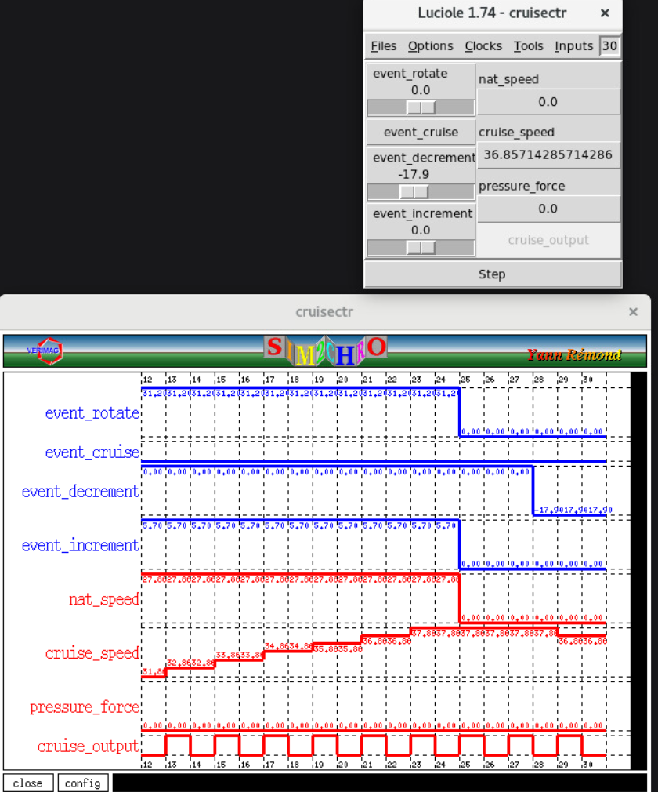

# README3 — Cruise Controller (Problem 4)

## 1. Overview

This project implements a hierarchical cruise controller in Lustre based on slides 32–36 of *Modeling Synchronous Systems*. The system is composed of the following nodes:

* `cruiseCtr` (top-level controller)
* `measureSpeed`
* `setSpeed`
* `controlSpeed`
* `changeSpeed`

The controller was tested using Luciole simulation (`make cruisectr-sim`). The implementation compiles without cycles and behaves as expected under interactive simulation.

---

## 2. Architecture and Node Responsibilities

### cruiseCtr (Top-Level Controller)

The `cruiseCtr` node defines the interaction between all subcomponents. It:

* Provides initial values for `rotate` and `f` (force)
* Determines whether rotation is sensor-driven or controller-driven
* Sets force to zero when cruise is off
* Connects all sub-nodes in the correct order

When cruise is:

* **Off** → rotation comes directly from sensor input
* **On** → rotation is modified via `changeSpeed()`

---

### measureSpeed

This node computes speed in mph from rotation:

```
speed = rotate * (10.0 * 60.0 / 672.0)
```

This converts the scaled RPM input into miles per hour as described in the assignment.

---

### setSpeed

This node:

* Toggles the cruise state when `event_cruise` is pressed
* Sets `cruise_speed` to current speed when first enabled
* Adjusts cruise speed using increment/decrement buttons
* Maintains previous cruise state via `pre(...)`

It outputs a tuple:

```
(on, cruise_speed)
```

---

### controlSpeed

This node implements a simple linear controller:

* Computes `error = cruise_speed - speed`
* Increases/decreases force when error is significant
* Gradually reduces force as error approaches zero
* Sets force to zero when magnitude is small

This creates smooth acceleration and deceleration behavior without using a PID controller.

---

### changeSpeed

This node models simplified vehicle dynamics:

```
rotate_out = rotate + f
```

When cruise is off, rotation passes through unchanged.
When cruise is on, force modifies rotation.

---

## 3. Avoiding Cycles

Cycles were avoided by using `pre(...)` to reference previous values of:

* rotation
* force
* cruise state

The top-level controller ensures that:

* New rotation depends on previous force
* New force depends on previous speed
* Cruise state updates do not create instantaneous feedback

All feedback loops are delayed by one clock tick, which preserves correct synchronous semantics and prevents algebraic cycles.

The program compiles without lv6 cycle errors.

---

## 4. Simulation Results (Luciole Testing)

Testing was performed using:

```
make cruisectr-sim
```

The system was validated through the following scenarios:

---

### Initialization

After one clock step:

* `on = false`
* `nat_speed = 0`
* `cruise_speed = 0`
* `pressure_force = 0`

Correct initial conditions were confirmed.

---

### Engage Cruise

After setting rotation and pressing cruise:

* `on = true`
* `cruise_speed` equals current speed
* `pressure_force = 0`

Cruise activation works correctly.

---

### Increase Cruise Speed

After pressing increment:

* `cruise_speed` increases by 1
* `pressure_force` increases gradually
* `nat_speed` increases smoothly
* As speed approaches target, force decreases

Observed behavior:

* Rapid initial acceleration
* Gradual reduction in force
* Minor oscillation near target
* Stable convergence

---

### Decrease Cruise Speed

After pressing decrement:

* `pressure_force` becomes negative
* Speed decreases smoothly
* System stabilizes at new cruise speed

---

### Stability

With no further inputs:

* `nat_speed ≈ cruise_speed`
* `pressure_force → 0`
* System reaches steady state

The controller stabilizes without divergence.

---

## 5. Driver Experience

From a user perspective:

* Acceleration feels gradual but responsive.
* Force increases quickly when error is large.
* As target speed is approached, acceleration softens.
* Small oscillations occur near equilibrium but settle.
* Deceleration behaves symmetrically.

The behavior resembles a simple proportional controller with damping.

---

## 6. Possible Improvements (Not Implemented)

The control logic could be improved by:

* Adding proportional gain tuning
* Adding a derivative term to reduce oscillation
* Clamping maximum force
* Introducing a deadband for small errors
* Implementing a full PID controller

These improvements would reduce oscillations and improve convergence smoothness.

---

## 7. Properties That Could Be Verified (Not Verified)

Potential formal properties include:

* If `on = false` then `pressure_force = 0`
* Cruise speed only changes when cruise is on
* Force magnitude remains bounded
* Speed eventually converges to cruise speed
* Rotation remains non-negative

Formal verification was not performed for this problem.

---

## 8. Build and Execution

### GUI Simulation

```
make cruisectr-sim
```

### Executable Build

```
make cruisectr-exe
```

Files generated in `gen/`.

---

## 9. Deliverables

Submitted files:

* `cruisectr.lus`
* `Makefile` (with targets `cruisectr-sim` and `cruisectr-exe`)
* `README3.md`

---

