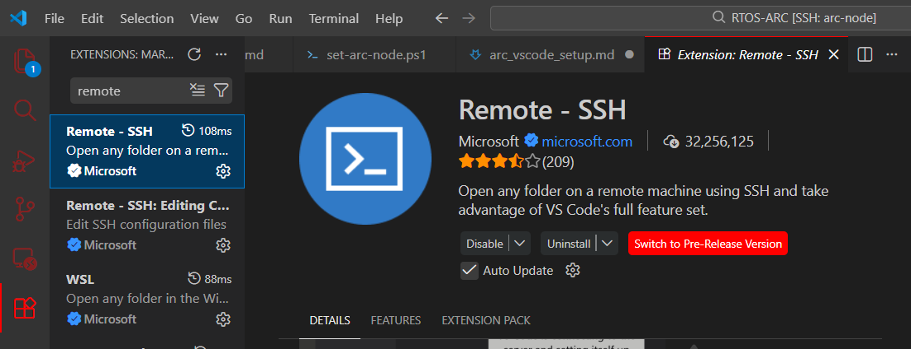
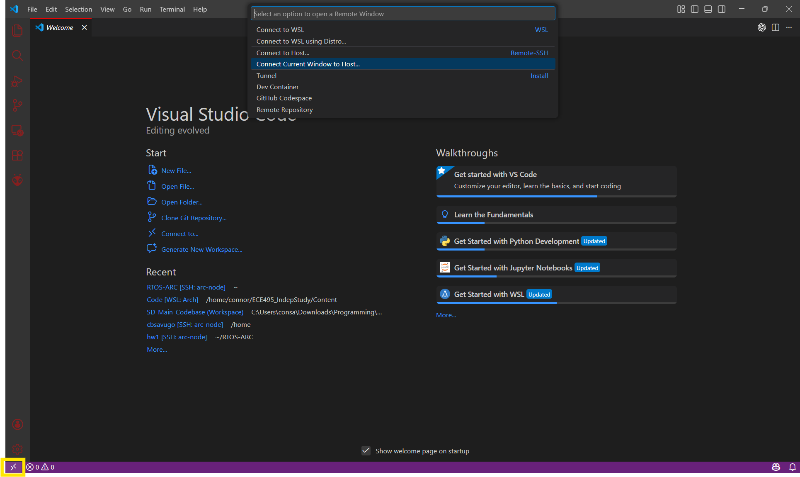
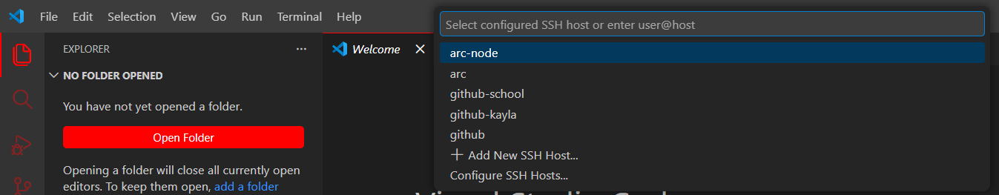
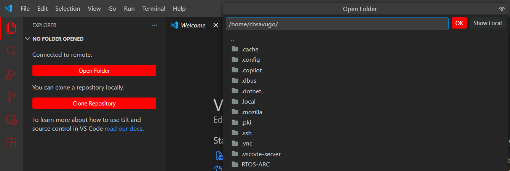

# Arc Remote Dev via VS Code

## Step 1.
Add the following to the top of your ssh config file, typically located in `~/.ssh` on Linux and `C:\Users\<user>\.ssh` on Windows. Mine is stored here: `C:\Users\<user>\.ssh\config`

Don't worry about this info being inaccurate, the script will fill it in with your details, but we need the template there first. 
```bash
# --- ARC Computer Cluster ---
# powershell -NoProfile -ExecutionPolicy Bypass -File "C:\Users\consa\Downloads\Academics\NC_STATE\2025-2026\SPRING_2026\RTOS_ML\RTOS-ARC\set-arc-node.ps1"

# ssh arc "squeue -u $USER -h -o %N | head -n 1" # SSH Into arc, request cluster, and print cluster number
# ssh arc "scancel -u $USER" # Exit Cluster and disconnect from SSH
# sinfo # Check node availability and partition info
# squeue # Shows who is holding what nodes and for how long
# --- --- --- --- --- --- ---

Host arc-node
  HostName c61
  User cbsavugo
  IdentityFile C:\Users\consa\.ssh\arc_cluster
  IdentitiesOnly yes
  ProxyJump arc

Host arc
  HostName arc.csc.ncsu.edu
  User cbsavugo
  IdentityFile C:\Users\consa\.ssh\arc_cluster

```

## Step 2.
Update Script to match your system configuration
```bash
# --- inputs ---
$SshDir  = "$env:USERPROFILE\.ssh"                 # ssh directory
$KeyPath = "C:\Users\consa\.ssh\arc_cluster"       # FULL PATH to private key file
$UnityId = "cbsavugo"                              # unity id / username
# -------------
```

## Step 3.
Run powershell script within command prompt
```bash
# Syntax
powershell -NoProfile -ExecutionPolicy Bypass -File <Path-to-Powershell-Script>

# Example
powershell -NoProfile -ExecutionPolicy Bypass -File "C:\Users\consa\Downloads\Academics\NC_STATE\2025-2026\SPRING_2026\RTOS_ML\RTOS-ARC\set-arc-node.ps1"
```

## Step 4.
Open a new Window in VS Code and install the `Remote - SSH` extension by Microsoft from the vs code extensions tab


## Step 5.
Restart VS Code when prompted after installing the extension to enable to extension

## Step 6.
**6.1** Click the purple arrows icon `><` in the bottom left
**6.2** Select `Connect Current Window to Host`
**6.3** Select `arc-node` from the list





## Step 7.
Click `Open Folder` and navigate to the remote folder you would like to open to start developing
